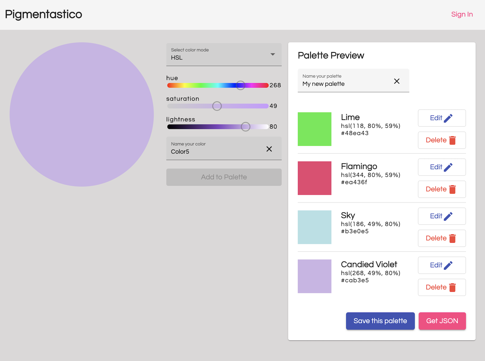

# palette-builder

This is an Angular web app that allows users to build color palettes using sliders in HSL or RBG mode. Users can add and remove colors to a palette as they are building, and save their color palettes for future reference. 

## Running this project locally

You'll need to make sure you machine has `node` installed. I recommend using `nvm` to install and use multiple versions of node on your machine. Because this project uses an older version of Angular, you'll have to use an older version of node (`12.x` will work) to run the `build` and `serve` commands or you'll get an error. I plan to upgrade this project to a newer Angular version in the near future!

### Install Dependencies

Run `npm i` to install all necessary packages. 

### Setting Up A Firebase Project

To run this locally you'll need to set up your own Firebase project to read and write data, as well as authenticate. 

You'll need a Google account to this. Navigate to the [Firebase Console](https://console.firebase.google.com/) and follow the instructions to create a new project. 

In the root project folder, locate the `environments` folder and open the `environment.ts` file. Replace the empty strings with the values for your project. All of this info can be found in the Settings section for your project in the Console.

Now you'll be able to create an authorized user for your project, and save palette data to Firestore.

### Running the Application

From the root project folder, ensure your shell is using the correct version of `node`, then run `ng build && ng serve`. When it's ready, you'll see a message to open your browser to view the project running on the development server. 